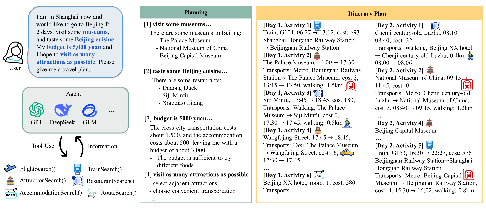

<center>
  <h1>ChinaTravel: A Real-World Benchmark for Language Agents in Chinese Travel Planning
</h1>
</center>

Official codebase for the paper "ChinaTravel: A Real-World Benchmark for Language Agents in Chinese Travel Planning".

<!-- | [Webpage](https://www.lamda.nju.edu.cn/shaojj/chinatravel/) | [Paper](https://arxiv.org/abs/2412.13682) | [Dataset(Huggingface)](https://huggingface.co/datasets/LAMDA-NeSy/ChinaTravel)| -->

[](https://www.lamda.nju.edu.cn/shaojj/chinatravel/)
[](https://arxiv.org/abs/2412.13682)
[](https://huggingface.co/datasets/LAMDA-NeSy/ChinaTravel)
[](https://chinatravel-competition.github.io/IJCAI2025/)
[](TPC@AIC2025/readme.md)


<!-- 
 -->

## 🏆 IJCAI 2025 Travel Planning Challenge (TPC@IJCAI)

We are proud to announce that ChinaTravel has been selected as the official benchmark for the **Travel Planning Challenge (TPC) @ IJCAI 2025**!

**Official Competition Website**:
[https://chinatravel-competition.github.io/IJCAI2025/](https://chinatravel-competition.github.io/IJCAI2025/)

Participants are invited to develop novel agents that can tackle real-world travel planning scenarios under complex constraints. This competition will showcase state-of-the-art approaches in language agent research.

## 📝 ChangeLog

### 2025.09
1. Upload the champion solution of TPC@IJCAI2025 DSL track. Thanks the [@evergreenee](https://github.com/evergreenee) for their contributions.  


### 2025.06

1. Fix error collection in the evaluation code of commonsense. 
2. Fix pure-neuro agent's pipeline
3. Fix load_datasets from huggingface
4. Update exception handling in syntax verification


### 2025.05

1. Update logs for the latest version.
2. Provide the evaluation code for the TPC.

### 2025.04

1. Added local data loader. Users can now load custom queries locally. When specifying non-default splits_name values (e.g., "abc") for "run_exp.py", the system will automatically load corresponding files from evaluation/default_splits/abc.txt, where the TXT file contains the target query filenames.
2. Detailed constraints classification. See detailed docs at [Evaluation README](chinatravel/symbol_verification/readme.md)
3. Introduced LLM-modulo baseline
   Implement the LLM-modulo pipeline with a ground-truth symbolic verifier.
   Based on methodology from:
   Paper: Robust Planning with Compound LLM Architectures: An LLM-Modulo Approach
   Codebase: https://github.com/Atharva-Gundawar/LLM-Modulo-prompts
4. Support local LLMs inference with Qwen3-8B/4B.

## 🚀 Quick Start

### ⚙️ Setup

1. Create a conda environment and install dependencies:

```bash
conda create -n chinatravel python=3.9  
conda activate chinatravel  
pip install -r requirements.txt  
```

2. Download the database and unzip it to the "chinatravel/environment/" directory

Download Links: [Google Drive](https://drive.google.com/drive/folders/1bJ7jA5cfExO_NKxKfi9qgcxEbkYeSdAU), [NJU Drive](https://box.nju.edu.cn/d/dd83e5a4a9e242ed8eb4/)

3. Download the open-source LLMs (optional).

```bash
bash download_llm.sh
```

4. Download the tokenizers.

```bash
wget https://cdn.deepseek.com/api-docs/deepseek_v3_tokenizer.zip -P chinatravel/local_llm/
unzip chinatravel/local_llm/deepseek_v3_tokenizer.zip -d chinatravel/local_llm/
```

### ▶️ Running

We support the deepseek (offical API from deepseek), gpt-4o (chatgpt-4o-latest), glm4-plus, and local inferences with Qwen (Qwen3-8B), llama, mistral (Mistral-7B-Instruct-v0.3), etc.

```bash
export OPENAI_API_KEY=""

python run_exp.py --splits easy --agent LLMNeSy --llm deepseek --oracle_translation
python run_exp.py --splits medium --agent LLMNeSy --llm deepseek --oracle_translation
python run_exp.py --splits human --agent LLMNeSy --llm deepseek --oracle_translation

python run_exp.py --splits human --agent LLMNeSy --llm Qwen3-8B --oracle_translation


python run_exp.py --splits human --agent LLMNeSy --llm deepseek 
python run_exp.py --splits human --agent LLMNeSy --llm Qwen3-8B 


python run_exp.py --splits human --agent LLM-modulo --llm deepseek --refine_steps 10 --oracle_translation
python run_exp.py --splits human --agent LLM-modulo --llm Qwen3-8B --refine_steps 10 --oracle_translation
```

**Note**:

- The `--oracle_translation` flag enables access to annotated ground truth including:

  - `hard_logic_py`: Executable verification DSL code
  - `hard_logic_nl`: The corrsponding constraint descriptions
  - Example annotation structure:

  ```python
  {
    "hard_logic_py": [
      "
      total_cost=0 
      for activity in allactivities(plan):
          total_cost+=activity_cost(activity)
              total_cost += innercity_transport_cost(activity_transports(activity))
      result=(total_cost<=1000)
      ", 
      "
      innercity_transport_set=set()
      for activity in allactivities(plan):
          if activity_transports(activity)!=[]:              
              innercity_transport_set.add(innercity_transport_type(activity_transports(activity)))
      result=(innercity_transport_set<={'taxi'})
      "
    ], 
    "hard_logic_nl": ["总预算为1800元", "市内交通选择taxi"], 
  }
  ```
- LLM-modulo method **requires** oracle_translation mode for its symbolic refinement process

### 📊 Evaluation

```bash
python eval_exp.py --splits human --method LLMNeSy_deepseek_oracletranslation
python eval_exp.py --splits human --method LLMNeSy_deepseek
python eval_exp.py --splits human --method LLM-modulo_deepseek_10steps_oracletranslation
python eval_exp.py --splits human --method LLM-modulo_Qwen3-8B_10steps_oracletranslation

```

In TPC@IJCAI2025, the evaluation code is provided in the `eval_tpc.py` file. You can run the evaluation code as follows:

```bash
python eval_tpc.py --splits tpc_phase1 --method YOUR_METHOD_NAME
```

## 📚 Docs

[Environment](chinatravel/environment/readme.md)
[Constraints](chinatravel/symbol_verification/readme.md)

## 🛠️ Advanced Development

### 1. Develop Your Own Agent Algorithm

To develop your own agent algorithm, you need to inherit the `BaseAgent` class from `chinatravel/agent/base.py` and add the logic for your algorithm to the `init_agent` function in `chinatravel/agent/load_model.py`. We provide an empty agent example named `TPCAgent`.

Steps:

- **Inherit the `BaseAgent` class**: Create a new Python file in the `chinatravel/agent` directory and define your own agent class, inheriting from `BaseAgent`.

```python:chinatravel/agent/your_agent.py
from .base import BaseAgent

class YourAgent(BaseAgent):
    def __init__(self, **kwargs):
        super().__init__(**kwargs)
        # Initialization logic

    def act(self, observation):
        # Implement the decision - making logic of the agent
        pass
```

- **Add code to the init_agent function**: Open the chinatravel/agent/load_model.py file and add support for your new agent in the init_agent function.

```python:
def init_agent(kwargs):
    # ... existing code ...
    elif kwargs["method"] == "YourMethodName":
        agent = YourAgent(
            **kwargs
        )
    # ... existing code ...
    return agent
```

### 2. Develop Your Own Local LLM

To develop your own local large - language model (LLM), you need to inherit the AbstractLLM class from chinatravel/agent/llms.py and add the corresponding local LLM inference code in llms.py. We provide an empty LLM example named TPCLLM.
Steps:

- **Inherit the AbstractLLM class**:  Define your own LLM class in the chinatravel/agent/llms.py file, inheriting from AbstractLLM.

```python
class YourLLM(AbstractLLM):
    def __init__(self):
        super().__init__()
        # Initialization logic
        self.name = "YourLLMName"

    def _get_response(self, messages, one_line, json_mode):
        # Implement the response logic of the LLM
        response = "Your LLM response"
        if json_mode:
            # Handle JSON mode
            pass
        elif one_line:
            # Handle one - line mode
            response = response.split("\n")[0]
        return response
```

- **Add code to the init_agent function**: Open the chinatravel/agent/load_model.py file and add support for your new llm in the init_llm function.

```python:
def init_llm(kwargs):
    # ... existing code ...
    elif llm_name == "glm4-plus":
        llm = YourLLM()
    # ... existing code ...
    return llm
```

### 3. Run Your Code Using Experiment Scripts

After completing the above development, you can use the experiment scripts to run your code.

Example of running:

```bash
python run_tpc.py --splits easy --agent TPCAgent --llm TPCLLM
python run_exp.py --splits easy --agent YourMethodName --llm YourLLMName
```

The results will be saved in the `results/YourMethodName_YourLLMName_xxx` directory, e.g., `results/TPCAgent_TPCLLM`.

## ✉️ Contact

If you have any problems, please contact [Jie-Jing Shao](shaojj@lamda.nju.edu.cn), [Bo-Wen Zhang](221900200@smail.nju.edu.cn), [Xiao-Wen Yang](yangxw@lamda.nju.edu.cn).

## 📌 Citation

If our paper or related resources prove valuable to your research, we kindly ask for citation.

```
@misc{shao2024chinatravelrealworldbenchmarklanguage,
      title={ChinaTravel: A Real-World Benchmark for Language Agents in Chinese Travel Planning}, 
      author={Jie-Jing Shao and Xiao-Wen Yang and Bo-Wen Zhang and Baizhi Chen and Wen-Da Wei and Guohao Cai and Zhenhua Dong and Lan-Zhe Guo and Yu-feng Li},
      year={2024},
      eprint={2412.13682},
      archivePrefix={arXiv},
      primaryClass={cs.AI},
      url={https://arxiv.org/abs/2412.13682}, 
}
```
